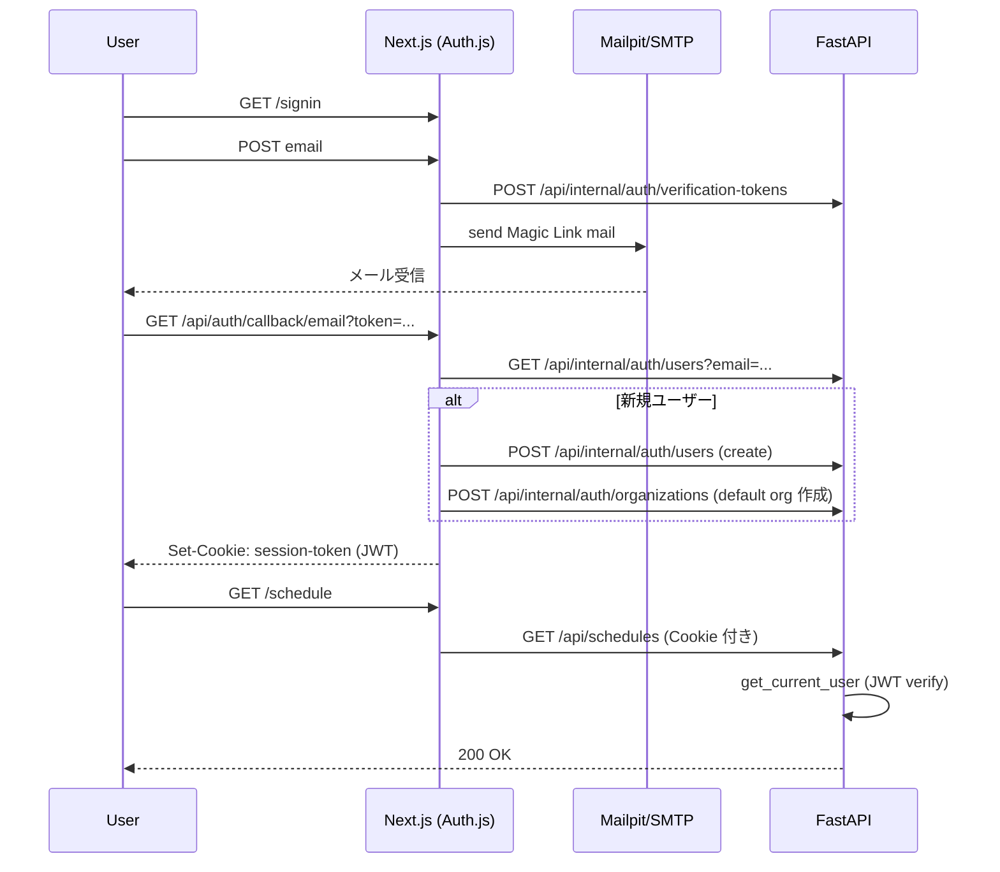

# Phase 0-1 認証実装 技術設計

> 作成日: 2026-04-30 / 対象: Phase 0-1 (18h) / 担当: 1asato23@gmail.com

## 1. 目的とスコープ

### 目的
シフトすけっと SaaS 化の最小要件として、**メールアドレスベースのパスワードレス認証**を導入する。Phase 0-2（マルチテナント化）以降のすべての機能が「ログイン済みユーザー × 所属組織」のコンテキストで動作する前提を整える。

### スコープ
- IN: ユーザー登録（Magic Link）、ログイン、ログアウト、セッション維持、Next.js 保護ルート、FastAPI 認可 Dependency、最小限のユーザー DB スキーマ
- OUT: 組織切り替え UI（Phase 0-2）、招待フロー（Phase 1-1）、SMTP 本番接続（Phase 1-2）、退会処理 UI（Phase 1-8）、RBAC（Phase 0-3）

### 非機能要件
- セッション TTL: 30 日（スライディング）
- API レイテンシ増加: 認可検証で +5ms 以内
- 既存テスト 73 (backend) + 66 (frontend) + E2E 3 を破壊しない（テストは認証バイパス可能に）

---

## 2. 採用技術と選定理由（Auth.js v5 + Magic Link）

| 項目 | 採用 | 理由 |
|------|------|------|
| 認証ライブラリ | **Auth.js v5（旧 NextAuth.js）** | App Router 公式対応、Magic Link / OAuth / Credentials を統一 API で扱える。エコシステム最大 |
| 認証方式 | **Email Magic Link（パスワードレス）** | パスワード管理コスト排除、SMB 店長向けに UX 単純、Phase 1-2 SMTP 整備と直結 |
| トークン形式 | **JWT（HS256）** | バックエンドが共有 Secret で stateless 検証可能。DB 往復不要 |
| メール送信（開発） | **Mailpit（ローカル SMTP キャプチャ）** | Phase 1-2 までの暫定。本番は Resend に切替 |
| Auth.js Adapter | **自前 SQLAlchemy 互換アダプタ（薄い HTTP 経由）** | §3 参照。Prisma を新規導入せず既存 SQLAlchemy 資産を活かす |

代替案は §9 で言及。

---

## 3. データモデル設計

### 3.1 新規テーブル

```python
# backend/backend/models.py に追加

class User(Base):
    __tablename__ = "users"
    id: Mapped[str] = mapped_column(String(36), primary_key=True)  # UUID v4
    email: Mapped[str] = mapped_column(String(255), unique=True, nullable=False, index=True)
    email_verified_at: Mapped[datetime | None] = mapped_column(DateTime, nullable=True)
    name: Mapped[str | None] = mapped_column(String(100), nullable=True)
    image: Mapped[str | None] = mapped_column(String(500), nullable=True)
    created_at: Mapped[datetime] = mapped_column(DateTime, default=datetime.utcnow)
    updated_at: Mapped[datetime] = mapped_column(DateTime, default=datetime.utcnow, onupdate=datetime.utcnow)
    deleted_at: Mapped[datetime | None] = mapped_column(DateTime, nullable=True)  # soft delete (Phase 1-8)


class Organization(Base):
    __tablename__ = "organizations"
    id: Mapped[str] = mapped_column(String(36), primary_key=True)
    name: Mapped[str] = mapped_column(String(100), nullable=False)
    slug: Mapped[str] = mapped_column(String(50), unique=True, nullable=False, index=True)
    created_at: Mapped[datetime] = mapped_column(DateTime, default=datetime.utcnow)
    deleted_at: Mapped[datetime | None] = mapped_column(DateTime, nullable=True)


class OrganizationMember(Base):
    __tablename__ = "organization_members"
    id: Mapped[int] = mapped_column(Integer, primary_key=True, autoincrement=True)
    user_id: Mapped[str] = mapped_column(ForeignKey("users.id", ondelete="CASCADE"), index=True)
    organization_id: Mapped[str] = mapped_column(ForeignKey("organizations.id", ondelete="CASCADE"), index=True)
    role: Mapped[str] = mapped_column(String(20), default="owner")  # owner|admin|member（Phase 0-3 で活用）
    joined_at: Mapped[datetime] = mapped_column(DateTime, default=datetime.utcnow)
    __table_args__ = (UniqueConstraint("user_id", "organization_id"),)


class VerificationToken(Base):
    """Magic Link 用の使い捨てトークン。Auth.js Email Provider 仕様に合わせる"""
    __tablename__ = "verification_tokens"
    identifier: Mapped[str] = mapped_column(String(255), primary_key=True)  # email
    token: Mapped[str] = mapped_column(String(255), primary_key=True)        # hashed
    expires: Mapped[datetime] = mapped_column(DateTime, nullable=False)
```

**Phase 0-1 では Account / Session テーブルは作らない**（JWT 戦略のため。§4 参照）。

### 3.2 Auth.js Adapter 戦略

Auth.js v5 公式 adapter は Prisma / Drizzle / TypeORM のみ。本プロジェクトは SQLAlchemy（Python 側）が真実の源なので、以下を採用：

- **Auth.js 側は HTTP Adapter（自前実装）** を使用し、`POST /api/internal/auth/users` 等のバックエンド API を叩く
- バックエンドに `/api/internal/auth/*` を新設し、共有 Secret（`AUTH_INTERNAL_SECRET`）でガード
- これにより Next.js プロセスから直接 DB に触らせず、SQLAlchemy / マイグレーションを単一の真実とする

代替案として「Next.js 側に Prisma を別途生やす」も検討したが、**スキーマ二重管理になるため却下**。

### 3.3 マイグレーション

`backend/backend/database.py` の `_run_migrations` に `CREATE TABLE IF NOT EXISTS` を追加。Phase 1-7 で Alembic 化。

---

## 4. セッション戦略（JWT 採用）

### 4.1 決定事項
- **JWT セッション（Auth.js `session: { strategy: "jwt" }`）を採用**
- 署名方式: HS256（Auth.js デフォルト）
- 共有 Secret: `AUTH_SECRET` 環境変数 → Next.js と FastAPI で同一値
- TTL: 30 日（スライディング更新）

### 4.2 JWT ペイロード

```json
{
  "sub": "user-uuid",
  "email": "owner@example.com",
  "name": "店長 太郎",
  "current_organization_id": "org-uuid",   // Phase 0-2 で注入
  "iat": 1714435200,
  "exp": 1717027200
}
```

### 4.3 退会即時無効化への対策

JWT は stateless ゆえ「退会後も TTL 切れまで有効」問題がある。対策：

1. **短 TTL + サイレントリフレッシュ**は採用しない（UX 劣化 & 複雑化）
2. **Revocation List（DB の `users.deleted_at`）を都度チェック**を採用
   - FastAPI Dependency 内で `user_id` の `deleted_at IS NOT NULL` を検証（毎リクエスト 1 SELECT）
   - キャッシュは Phase 0-1 では入れない（小規模 SaaS 想定）

### 4.4 Cookie 設定
- `__Secure-authjs.session-token`（本番）/ `authjs.session-token`（開発）
- `HttpOnly; Secure; SameSite=Lax; Path=/`

---

## 5. バックエンド認可（FastAPI Dependency 設計）

### 5.1 共通 Dependency

```python
# backend/backend/auth.py（新規）
from fastapi import Depends, HTTPException, status, Cookie, Header
from jose import jwt, JWTError
from sqlalchemy.orm import Session
from .database import get_db
from .models import User, OrganizationMember
import os

AUTH_SECRET = os.environ["AUTH_SECRET"]
ALGORITHM = "HS256"
COOKIE_NAME = "authjs.session-token"  # 本番では __Secure- prefix


def _decode(token: str) -> dict:
    try:
        return jwt.decode(token, AUTH_SECRET, algorithms=[ALGORITHM])
    except JWTError:
        raise HTTPException(status.HTTP_401_UNAUTHORIZED, "Invalid token")


def get_current_user(
    session_token: str | None = Cookie(default=None, alias=COOKIE_NAME),
    authorization: str | None = Header(default=None),  # Bearer 経路（テスト・SSR 用）
    db: Session = Depends(get_db),
) -> User:
    token = session_token or (authorization.removeprefix("Bearer ") if authorization else None)
    if not token:
        raise HTTPException(status.HTTP_401_UNAUTHORIZED, "Not authenticated")

    payload = _decode(token)
    user_id: str = payload.get("sub")
    user = db.query(User).filter(User.id == user_id, User.deleted_at.is_(None)).first()
    if not user:
        raise HTTPException(status.HTTP_401_UNAUTHORIZED, "User not found or deleted")
    return user


def get_current_organization_id(
    user: User = Depends(get_current_user),
    session_token: str | None = Cookie(default=None, alias=COOKIE_NAME),
) -> str:
    """Phase 0-2 で本実装。Phase 0-1 では JWT 内 current_organization_id を返すか、
    members の最初の 1 件を返すスタブ"""
    payload = _decode(session_token) if session_token else {}
    org_id = payload.get("current_organization_id")
    if not org_id:
        raise HTTPException(status.HTTP_403_FORBIDDEN, "No active organization")
    return org_id
```

### 5.2 既存 32 エンドポイントへの適用

- Phase 0-1 では `get_current_user` のみを全 32 エンドポイントに付与（`Depends(get_current_user)`）
- `get_current_organization_id` の利用と WHERE 句注入は **Phase 0-2 の責務**（本フェーズは hook の用意のみ）
- テスト時バイパス: `app.dependency_overrides[get_current_user] = lambda: test_user_fixture`

---

## 6. フロントエンド統合

### 6.1 ファイル構成

```
frontend/
├── app/
│   ├── api/auth/[...nextauth]/route.ts   # Auth.js ハンドラ
│   ├── (auth)/signin/page.tsx            # サインインフォーム
│   ├── (auth)/verify-request/page.tsx    # 「メール確認してください」画面
│   └── layout.tsx                        # SessionProvider 追加
├── auth.ts                                # Auth.js v5 設定（NextAuth() の呼び出し）
├── auth.config.ts                         # callbacks, providers
├── middleware.ts                          # 保護ルート定義（新規）
└── lib/
    ├── api.ts                             # credentials: "include" 追加
    └── auth-adapter.ts                    # 自前 HTTP Adapter
```

### 6.2 middleware.ts（保護ルート）

```typescript
// frontend/middleware.ts
import { auth } from "@/auth";

export default auth((req) => {
  const isAuth = !!req.auth;
  const isAuthPage = req.nextUrl.pathname.startsWith("/signin")
                  || req.nextUrl.pathname.startsWith("/verify-request");
  if (!isAuth && !isAuthPage) {
    return Response.redirect(new URL("/signin", req.url));
  }
});

export const config = {
  matcher: ["/((?!api/auth|_next/static|_next/image|favicon.ico).*)"],
};
```

### 6.3 lib/api.ts の変更

```typescript
const res = await fetch(`${API_BASE}${path}`, {
  headers: { "Content-Type": "application/json" },
  credentials: "include",  // Cookie を FastAPI に送る
  ...options,
});
if (res.status === 401) {
  window.location.href = "/signin";
  throw new Error("Unauthorized");
}
```

### 6.4 サインインフロー（Mermaid）



---

## 7. 他フェーズとの境界

### 7.1 Phase 0-2（マルチテナント化）への接続契約
- **本フェーズが提供**: `get_current_organization_id` Dependency の hook、JWT 内 `current_organization_id` クレーム、`organization_members` テーブル
- **Phase 0-2 が実装**: 全 SQLAlchemy クエリへの `WHERE organization_id = :current` 注入、組織切替 UI、招待リンク

### 7.2 Phase 0-4（ドメイン取得）との関係
- 認証 Cookie の `Domain` 属性を環境変数化（`AUTH_COOKIE_DOMAIN`）
- 開発: undefined（localhost）／本番: `.shift-suketto.app`（仮）
- サブドメインテナンシー（例: `acme.shift-suketto.app`）導入時にも Cookie 共有可能な設計

### 7.3 Phase 1-1（オンボーディング）

> **Deprecated (2026-05-05)**: 本セクションは Phase 0-1 の仮置き設計です。
> Phase 1-1 で「明示オンボーディング画面」採用に変更されました。
> 最新仕様は `docs/plans/2026-05-05-phase1-1-onboarding-design.md` を参照してください。

- **本フェーズが提供**: 初回サインイン時にデフォルト組織を 1 つ自動作成（slug = email ローカル部 + ランダム 4 桁）
- **Phase 1-1 が実装**: 組織名変更、初期スタッフ登録ウィザード、サンプルデータ投入

### 7.4 Phase 1-2（SMTP/Resend）
- **本フェーズが提供**: Auth.js Email Provider 設定の `server` を環境変数化
- **Phase 1-2 が実装**: Resend SMTP 接続、SPF/DKIM、テンプレート整備
- 暫定: 開発は Mailpit、ステージングは MailHog or Ethereal

### 7.5 Phase 1-8（退会・データ削除）
- **本フェーズの決断**:
  - `users.deleted_at` で論理削除 → JWT 検証時に拒否
  - 組織の最終メンバーが退会した場合: **組織は `deleted_at` でソフトデリート、30 日後にハード削除**（Phase 1-8 でバッチ実装）
  - 退会したユーザーの `organization_members` レコードは即時物理削除（CASCADE）
- **Phase 1-8 が実装**: 退会 UI、データエクスポート、ハード削除バッチ

---

## 8. テスト戦略

### 8.1 既存テストへの影響

| テスト群 | 影響 | 対応 |
|---------|------|------|
| backend 73 件 | 全 API が 401 返すようになる | conftest.py で `dependency_overrides` により `get_current_user` をバイパスし、テスト用 User fixture を注入 |
| frontend 66 件 | API クライアントモック層は無影響 | `next-auth/react` の `useSession` をモック |
| E2E 3 件 | サインインステップが必須に | Playwright `storageState` でログイン済み状態を保存・再利用 |

### 8.2 新規テスト

- **backend**:
  - `test_auth_jwt.py`: JWT decode 成功・失敗・期限切れ
  - `test_auth_dependency.py`: 認証なし 401、削除済みユーザー 401、正常系 200
  - `test_internal_auth_api.py`: 内部 API の Secret 検証
- **frontend**:
  - `signin.test.tsx`: フォーム送信、メール送信成功画面
  - `middleware.test.ts`: 未ログイン時のリダイレクト
- **E2E**:
  - `auth.spec.ts`: Mailpit API からトークン取得 → コールバック → /schedule 到達

---

## 9. リスクと回避策

| # | リスク | 影響度 | 回避策 |
|---|-------|-------|-------|
| 1 | Auth.js v5 が正式 GA 前で破壊的変更の可能性 | 中 | バージョン pin（`5.0.0-beta.x`）、リリースノート追跡。代替候補: Lucia v3（より軽量だが App Router 統合は手作業）、Clerk（高額・データ越境懸念で却下） |
| 2 | SMTP 未整備期間（Phase 1-2 まで）に Magic Link が届かない | 高 | 開発: Mailpit、ステージング: 自分宛 Gmail SMTP 暫定。Phase 1-2 を Phase 0-1 直後に着手 |
| 3 | 組織未紐づきユーザー（招待途中で離脱等）の存在 | 中 | サインイン直後に必ずデフォルト組織を作成。`current_organization_id` が空の JWT は発行しない |
| 4 | CSRF（API は Cookie 認証のため） | 高 | Auth.js の CSRF token 機構を有効化。FastAPI 側は SameSite=Lax で防御し、状態変更 API には Origin ヘッダ検証を追加（Phase 0-3 で強化） |
| 5 | セッション固定攻撃 | 中 | Magic Link 検証成功時に新規 JWT を発行（既存セッション無効化） |
| 6 | JWT Secret 漏洩時の被害範囲 | 高 | Secret ローテーション手順を runbook 化、`AUTH_SECRET` を Railway/Vercel の暗号化変数に格納 |
| 7 | 自前 HTTP Adapter の実装バグ | 中 | Auth.js Adapter インターフェース仕様（`createUser`, `getUserByEmail`, `linkAccount`, `createSession` 等）を網羅したユニットテスト必須 |

---

## 10. 実装順序（18h の内部分割）

| # | サブタスク | 工数 | DoD |
|---|-----------|------|-----|
| 1 | DB モデル & マイグレーション | 3h | `users` / `organizations` / `organization_members` / `verification_tokens` 4 テーブルが SQLite に作成され、`pytest` がグリーン |
| 2 | バックエンド内部認証 API | 3h | `/api/internal/auth/*` 6 エンドポイント実装、Secret ガード、curl で CRUD 動作確認 |
| 3 | Auth.js v5 設定 + HTTP Adapter | 4h | `/signin` でメール送信 → Mailpit 受信 → コールバックで Cookie 発行 → `/schedule` 表示 |
| 4 | FastAPI Dependency 適用 | 3h | 既存 32 エンドポイントに `Depends(get_current_user)` 付与、テスト 73 件がフィクスチャ経由で全 PASS |
| 5 | Next.js middleware + lib/api.ts | 2h | 未ログインで `/schedule` → `/signin` リダイレクト、ログイン後 API 呼び出し成功 |
| 6 | テスト追加 + E2E 修正 | 3h | 新規 backend/frontend テスト 10 件追加、E2E 3 件が `storageState` 経由で PASS |

---

## 11. 未決事項・確認結果

2026-04-30 にユーザー（1asato23@gmail.com）が **すべて Planner 提案どおりで採用** と確認：

1. ✅ **デフォルト組織名**: メールローカル部 + ランダム 4 桁の slug、表示名「マイ組織」で初期化。ユーザーは設定画面で後から変更可。
2. ✅ **開発時 SMTP**: **Mailpit を docker-compose に追加**（GUI でメール内容確認可の利点を優先）。Console Provider は不採用。
3. ✅ **`AUTH_SECRET` 管理**: 開発 `.env.local`（gitignore 済）／本番 Railway・Vercel の環境変数。Phase 0-1 着手時に `openssl rand -base64 32` で初期生成。
4. ✅ **既存テスト 73 件の認証バイパス**: `conftest.py` で `dependency_overrides` をグローバル適用するフィクスチャを用意。各テストはデフォルトでスタブユーザー使用、認証検証テストのみ override 解除。
5. ✅ **退会時の組織セマンティクス**: 最終メンバー退会で組織は 30 日猶予のソフトデリート。猶予期間中は復元可、満了で物理削除（バッチは Phase 1-8 実装）。法務観点は KIYAC ベース規約に明記。
6. ✅ **本番ドメイン確定時期**: Phase 0-4（ドメイン取得）前に Cookie 設計は `localhost` 前提で凍結進行 OK。Phase 0-4 完了時に `__Secure-` プレフィックスと `SameSite` 設定を本番ドメインで再確認。

---

## 実行サマリ

1. **設計ファイル**: `/Users/asato/Documents/dev/dev_shift-scheduling/docs/plans/2026-04-30-phase0-1-auth-design.md`
2. **3つの主要意思決定**:
   (a) Auth.js v5 + Email Magic Link + JWT セッション採用
   (b) Auth.js Adapter は SQLAlchemy 二重管理を避け、自前 HTTP Adapter で FastAPI 内部 API を叩く
   (c) 退会は `users.deleted_at` 論理削除＋毎リクエスト検証、最終メンバー退会で組織は 30 日猶予ソフトデリート
3. **3つの未決事項**:
   (a) 開発 SMTP は Mailpit か Console Provider か
   (b) デフォルト組織の命名規則
   (c) 既存 73 テストの認証バイパス方針（グローバル override か個別注入か）
