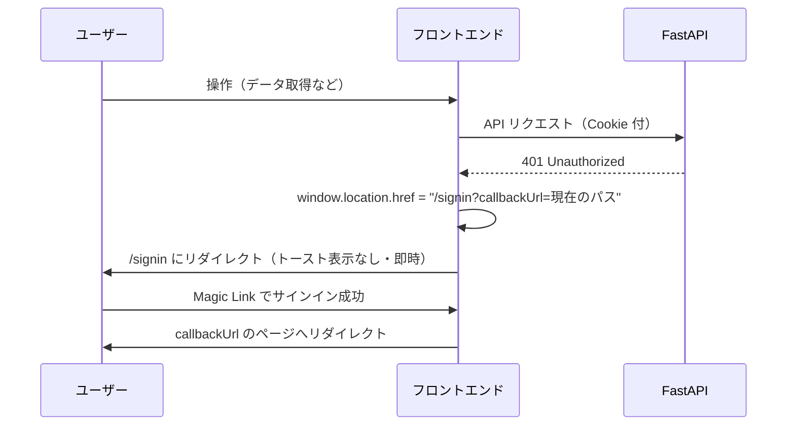

# Phase 0-1 認証実装 UI/UX 設計

> 作成日: 2026-04-30 / 対象: Phase 0-1 (18h) / 担当: 1asato23@gmail.com
> 前提: docs/plans/2026-04-30-phase0-1-auth-design.md（Planner 確定済）

---

## 1. デザイン原則

### 1.1 既存 UI トーンの継承

既存の `app/layout.tsx` は Geist フォント、`border-b bg-white` のヘッダー、`text-sm font-medium` のナビリンクという、シンプルで清潔なデザインを採用している。認証 UI はこのトーンを崩さない。

- 背景は `bg-white` または `bg-gray-50`（ページ全体の軽い区分け）
- ボーダーは `border` / `border-gray-200` のみ。装飾的なシャドウは Card コンポーネントのデフォルトに限定する
- フォントサイズは既存通り `text-sm` ベース、見出しのみ `text-xl` 以上

### 1.2 shadcn/ui を最優先利用

新規カスタムスタイルを最小化し、shadcn/ui の以下コンポーネントを直接使う。

- `Button`, `Input`, `Label`, `Card`, `CardContent`, `CardHeader`, `CardTitle`, `CardDescription`
- `Alert`, `AlertDescription`
- `DropdownMenu`, `DropdownMenuTrigger`, `DropdownMenuContent`, `DropdownMenuItem`
- `Avatar`, `AvatarFallback`
- `Separator`

### 1.3 派手なアニメーション・独自コンポーネントは作らない

フォーカスリング・ホバー色変化はすべて shadcn/ui のデフォルト Tailwind クラスで対応する。独自アニメーションは一切追加しない。

---

## 2. 画面一覧と遷移図

### 2.1 画面一覧

| 画面 | パス | 認証要否 | 備考 |
|------|------|----------|------|
| サインイン | `/signin` | 不要 | 未認証ユーザーのランディング |
| メール送信完了 | `/verify-request` | 不要 | Magic Link 送信後 |
| 認証エラー | `/auth/error` | 不要 | リンク失効・サーバーエラー |
| シフト表（既存） | `/schedule` | 必要 | ログイン後デフォルト遷移 |
| 設定（既存） | `/settings` | 必要 | - |
| 希望入力（既存） | `/staff` | 必要 | - |
| シフト確認（既存） | `/view` | 必要 | - |

### 2.2 画面遷移フロー

```mermaid
flowchart TD
    A[未認証でアクセス] -->|middleware リダイレクト| B[/signin]
    B -->|メール送信成功| C[/verify-request]
    C -->|メール内 Magic Link クリック| D{検証結果}
    D -->|成功・初回ユーザー| E[/schedule\n※オンボーディング誘導モーダル表示]
    D -->|成功・既存ユーザー| F[/schedule\n※元のページがあればそこへ]
    D -->|失敗（リンク失効など）| G[/auth/error]
    G -->|「再試行」リンク| B
    B -->|ロゴクリック| B
    E -->|モーダル「後で設定」| F
    E -->|モーダル「設定する」| H[/settings]
```

### 2.3 セッション切れ時の遷移



401 時は**即時リダイレクト**（モーダルなし）。`lib/api.ts` の共通エラーハンドラが `callbackUrl` を付与して遷移する。

---

## 3. 画面別 UI 仕様

### 3.1 `/signin` — サインイン画面

#### レイアウト（ワイヤフレーム）

```
┌─────────────────────────────────────────────┐
│  [header なし: この画面はヘッダーを表示しない]   │
│                                             │
│            シフトすけっと ロゴ文字            │
│   小規模店舗のシフト作成を、もっとかんたんに。   │
│                                             │
│  ┌─────────────────────────────────────┐    │
│  │  メールアドレスでログイン / 新規登録   │    │
│  │                                     │    │
│  │  メールアドレス                      │    │
│  │  ┌─────────────────────────────┐    │    │
│  │  │ example@example.com         │    │    │
│  │  └─────────────────────────────┘    │    │
│  │                                     │    │
│  │  [  Magic Link を送信  ]            │    │
│  │                                     │    │
│  │  ─────────────────────────────     │    │
│  │  ※ 送信するとメールが届きます。       │    │
│  │    パスワード不要でログインできます。   │    │
│  └─────────────────────────────────────┘    │
│                                             │
│  利用規約 ・ プライバシーポリシー              │
└─────────────────────────────────────────────┘
```

- レイアウト: `min-h-screen flex flex-col items-center justify-center bg-gray-50`
- カード幅: `w-full max-w-sm`（モバイルでは `mx-4`）
- ヘッダーナビゲーションは**非表示**（`(auth)` ルートグループは別レイアウトを持つ）

#### 使用コンポーネント

| コンポーネント | 用途 |
|--------------|------|
| `Card`, `CardHeader`, `CardTitle`, `CardDescription` | フォームコンテナ |
| `Label`, `Input` | メールアドレス入力 |
| `Button` | 送信ボタン |
| `Alert`, `AlertDescription` | エラーメッセージ表示 |

#### インタラクション仕様

| 状態 | 挙動 |
|------|------|
| 初期表示 | Input にオートフォーカス |
| 入力中 | リアルタイムバリデーションなし（送信後に検証） |
| 送信中 | Button が `disabled` + `<Loader2 className="animate-spin" />` アイコン表示 |
| 送信成功 | `/verify-request?email=xxx` へ遷移 |
| メール形式不正 | Input 下に `text-sm text-destructive` でインラインエラー |
| 送信失敗（サーバーエラー） | Card 上部に `<Alert variant="destructive">` 表示 |
| レート制限 | `Alert` に「しばらく時間を置いてから再試行してください」と表示 |
| `callbackUrl` クエリパラメータあり | サインイン成功後 `callbackUrl` へリダイレクト |

#### エラーメッセージ分岐

```
メール形式不正      → 「正しいメールアドレスを入力してください」
送信失敗（5xx）     → 「メールの送信に失敗しました。しばらくしてから再試行してください」
レート制限（429）   → 「送信回数の上限に達しました。10分後に再試行してください」
```

---

### 3.2 `/verify-request` — メール送信完了画面

#### レイアウト（ワイヤフレーム）

```
┌─────────────────────────────────────────────┐
│  [header なし]                               │
│                                             │
│  ┌─────────────────────────────────────┐    │
│  │  メールを送信しました                  │    │
│  │                                     │    │
│  │  📧 [メールアイコン: lucide-react]    │    │
│  │                                     │    │
│  │  example@example.com 宛に            │    │
│  │  ログインリンクを送りました。           │    │
│  │  メールを開いてリンクをクリックして    │    │
│  │  ください。                          │    │
│  │                                     │    │
│  │  ─────────────────────────────     │    │
│  │                                     │    │
│  │  メールが届かない場合は？             │    │
│  │  • 迷惑メールフォルダを確認してください │    │
│  │  • [別のアドレスで試す] リンク        │    │
│  └─────────────────────────────────────┘    │
└─────────────────────────────────────────────┘
```

- メールアドレスは URL クエリパラメータ `?email=` から取得して表示（未指定時は非表示）
- 「別のアドレスで試す」は `/signin` への `<Link>` テキストリンク（`text-sm text-primary underline`）

#### 使用コンポーネント

| コンポーネント | 用途 |
|--------------|------|
| `Card`, `CardContent` | コンテナ |
| `Mail`（lucide-react） | メールアイコン（`h-12 w-12 text-muted-foreground`） |
| `Separator` | 区切り線 |
| `Link`（next/link） | 「別のアドレスで試す」リンク |

#### インタラクション仕様

- 自動的なポーリング・リダイレクトは**行わない**（Magic Link はメール経由のため）
- ページリロードしても同じ画面を表示する（URL に `email` が残るため）

---

### 3.3 `/auth/error` — 認証エラー画面

#### レイアウト（ワイヤフレーム）

```
┌─────────────────────────────────────────────┐
│  [header なし]                               │
│                                             │
│  ┌─────────────────────────────────────┐    │
│  │  ログインできませんでした             │    │
│  │                                     │    │
│  │  [エラー種別に応じたメッセージ]       │    │
│  │                                     │    │
│  │  [  もう一度ログインする  ]          │    │
│  └─────────────────────────────────────┘    │
└─────────────────────────────────────────────┘
```

#### エラー種別とメッセージ

Auth.js v5 は `/auth/error?error=` クエリパラメータでエラー種別を渡す。

| `error` 値 | 表示メッセージ |
|-----------|-------------|
| `Verification` | 「ログインリンクの有効期限が切れています。もう一度メールを送信してください。」 |
| `AccessDenied` | 「このアカウントはアクセスが制限されています。管理者にお問い合わせください。」 |
| `Configuration` | 「システムの設定に問題が発生しました。しばらく時間を置いてから再試行してください。」 |
| その他・未定義 | 「ログイン中にエラーが発生しました。もう一度お試しください。」 |

#### 使用コンポーネント

| コンポーネント | 用途 |
|--------------|------|
| `Card`, `CardHeader`, `CardTitle`, `CardContent` | コンテナ |
| `Alert`, `AlertDescription` | エラーメッセージ表示 |
| `Button` | 「もう一度ログインする」ボタン（`/signin` へ遷移） |
| `AlertCircle`（lucide-react） | エラーアイコン |

---

### 3.4 ナビゲーションバーの拡張

#### 現在の構造

`app/layout.tsx` の `<header>` 内、`<nav>` の右端に認証 UI を追加する。

#### 拡張後のレイアウト

```
┌──────────────────────────────────────────────────────────────────┐
│  シフトすけっと     設定  希望入力  シフト確認  シフト表  [ユーザー]  │
└──────────────────────────────────────────────────────────────────┘

[ユーザー] 部分の展開:
  未ログイン時  → [ログイン] ボタン（Button variant="outline" size="sm"）
  ログイン済み  → Avatar（イニシャル円形）クリックで DropdownMenu
                  ┌──────────────────┐
                  │ example@example  │  ← メールアドレス（グレー小文字）
                  │ ──────────────── │
                  │ ログアウト        │
                  └──────────────────┘
```

#### Avatar のイニシャル生成ルール

- `user.name` がある場合: 姓名の頭文字 2 文字（例: 「田中 太郎」→「田太」）
- `user.name` がない場合: `user.email` の先頭 2 文字（例: `ta` → `TA`）
- `AvatarFallback` の背景色: `bg-primary text-primary-foreground`（shadcn/ui デフォルト）
- サイズ: `h-8 w-8`（既存ヘッダーの `h-14` に収まるサイズ）

#### 既存ナビとの共存

- `<nav>` の `flex gap-6` に `items-center` を追加し、Avatar と高さを揃える
- ナビリンクはログイン済み時のみ表示する（未ログイン時はロゴのみ）
  - middleware がリダイレクトするため未ログインで既存ページは表示されないが、念のため `useSession` でチェック

#### 使用コンポーネント

| コンポーネント | 用途 |
|--------------|------|
| `Avatar`, `AvatarFallback` | ユーザーアバター表示 |
| `DropdownMenu`, `DropdownMenuTrigger`, `DropdownMenuContent`, `DropdownMenuItem`, `DropdownMenuSeparator` | ユーザーメニュー |
| `Button` | 未ログイン時の「ログイン」ボタン |

---

### 3.5 401 リダイレクト UX

#### 設計方針

**即時リダイレクト**を採用。モーダル表示は行わない。

理由: 小規模店舗向けアプリは画面が少なく、セッション切れの頻度も低い。モーダルによる複雑な実装より「ログインして戻ってくる」シンプルフローが適合する。

#### 挙動の詳細

```
1. API レスポンスが 401
     ↓
2. lib/api.ts の共通エラーハンドラが実行
     ↓
3. window.location.href = `/signin?callbackUrl=${encodeURIComponent(window.location.pathname)}`
     ↓
4. /signin でサインイン完了
     ↓
5. Auth.js が callbackUrl へリダイレクト
```

- `callbackUrl` はパス名のみ（クエリパラメータ含む場合も encodeURIComponent で安全化）
- Auth.js v5 は `callbackUrl` に Open Redirect 対策のオリジン検証が組み込まれている

---

## 4. コンポーネント構成

### 4.1 新規作成ファイル一覧

| ファイルパス | 種別 | 概要 |
|------------|------|------|
| `frontend/app/(auth)/layout.tsx` | Layout | ヘッダーなし・中央寄せのサインイン専用レイアウト |
| `frontend/app/(auth)/signin/page.tsx` | Page | サインイン画面 |
| `frontend/app/(auth)/verify-request/page.tsx` | Page | メール送信完了画面 |
| `frontend/app/(auth)/auth/error/page.tsx` | Page | 認証エラー画面 |
| `frontend/components/auth/user-nav.tsx` | Component | ナビゲーションバーのユーザー部分（Avatar + DropdownMenu） |
| `frontend/components/auth/sign-in-form.tsx` | Component | メールアドレス入力フォーム |

### 4.2 既存ファイルの変更箇所

| ファイルパス | 変更内容 |
|------------|---------|
| `frontend/app/layout.tsx` | `SessionProvider` 追加、`<nav>` に `<UserNav />` 追加、未ログイン時リンク非表示 |
| `frontend/lib/api.ts` | `credentials: "include"` 追加、401 時の `callbackUrl` 付きリダイレクト |

### 4.3 コンポーネント詳細 Props 設計

**`UserNav` コンポーネント**

```typescript
// frontend/components/auth/user-nav.tsx
// Props なし。useSession() からセッション情報を取得するクライアントコンポーネント。
// "use client" ディレクティブ必須。
```

**`SignInForm` コンポーネント**

```typescript
// frontend/components/auth/sign-in-form.tsx
interface SignInFormProps {
  callbackUrl?: string;  // URL クエリから渡される。未指定時は "/schedule"
}
```

---

## 5. レスポンシブ対応

### 5.1 ブレークポイント方針

Tailwind CSS のデフォルトブレークポイントを使用する。

| ブレークポイント | 幅 | 認証画面の挙動 |
|--------------|-----|-------------|
| デフォルト（モバイル） | < 640px | カード `mx-4`、フルほぼ幅 |
| `sm`（タブレット） | 640px〜 | カード `max-w-sm`（384px）、中央寄せ |
| `md`（デスクトップ） | 768px〜 | 変化なし（`max-w-sm` 固定） |

### 5.2 ナビゲーションのモバイル対応

Phase 0-1 では**ハンバーガーメニューは実装しない**。既存ナビがモバイルでも横スクロール許容の設計のため、同様に扱う。

ユーザーアバター部分は `shrink-0` を付けてナビリンクのスクロール外に固定する。

---

## 6. アクセシビリティ

### 6.1 フォーカス管理

| 画面 | フォーカスの初期位置 |
|------|-----------------|
| `/signin` | メールアドレス `<Input>` に `autoFocus` |
| `/verify-request` | ページ `<h1>` または最初のインタラクティブ要素 |
| `/auth/error` | 「もう一度ログインする」`<Button>` に `autoFocus` |

### 6.2 ARIA

- フォームエラーは `aria-describedby` で `<Input>` とエラーメッセージを関連付ける
- 送信中の `<Button>` は `aria-busy="true"` を付与する
- DropdownMenu は shadcn/ui が WAI-ARIA 準拠のため追加対応不要

```tsx
// エラー表示の実装パターン
<Input
  id="email"
  aria-describedby={emailError ? "email-error" : undefined}
  aria-invalid={!!emailError}
/>
{emailError && (
  <p id="email-error" className="text-sm text-destructive">{emailError}</p>
)}
```

### 6.3 キーボード操作

| 操作 | 挙動 |
|------|------|
| `Tab` | Input → Button の順にフォーカス移動 |
| `Enter`（Input フォーカス中） | フォームを送信（`<form>` の暗黙的な submit） |
| `Escape`（DropdownMenu 展開中） | DropdownMenu を閉じる（shadcn/ui デフォルト） |

### 6.4 色コントラスト

- 既存の Tailwind + shadcn/ui デフォルトテーマは WCAG AA 基準（コントラスト比 4.5:1 以上）を満たす
- `text-muted-foreground` は補足説明テキストのみに使用し、操作に必要なテキストには使わない

---

## 7. コピーライティング

### 7.1 トーン＆マナー

- 対象: 小規模店舗の店長・オーナー（IT リテラシーは中程度）
- トーン: 丁寧かつ平易。硬すぎず、砕けすぎず
- 体言止めを活用し、簡潔にする
- カタカナ英語は必要最小限（「Magic Link」は初出のみ説明付き）

### 7.2 各画面のコピー

**`/signin`**

```
ロゴ下キャッチ:
「小規模店舗のシフト作成を、もっとかんたんに。」

Card タイトル:
「ログイン / 新規登録」

Card サブタイトル:
「メールアドレスを入力すると、ログイン用のリンクをお送りします。パスワードは不要です。」

Input プレースホルダー:
「example@example.com」

Button ラベル:
「ログインリンクを送る」（送信中: 「送信中...」）

フッター:
「送信することで、利用規約とプライバシーポリシーに同意したものとみなします。」
```

**`/verify-request`**

```
Card タイトル:
「メールを送信しました」

本文:
「{email} にログインリンクをお送りしました。メールを開いてリンクをクリックしてください。」

注記:
「メールが届かない場合は、迷惑メールフォルダをご確認ください。」

リンク:
「別のメールアドレスで試す」
```

**`/auth/error`**

```
Card タイトル:
「ログインできませんでした」

エラー別本文:
  リンク失効: 「ログインリンクの有効期限が切れています。もう一度メールを送信してください。」
  アクセス拒否: 「このアカウントはアクセスが制限されています。管理者にお問い合わせください。」
  設定エラー: 「システムの設定に問題が発生しました。しばらく時間を置いてから再試行してください。」
  その他: 「ログイン中にエラーが発生しました。もう一度お試しください。」

Button ラベル:
「もう一度ログインする」
```

**ナビゲーションバー**

```
未ログイン時 Button: 「ログイン」
DropdownMenu ログアウト項目: 「ログアウト」
DropdownMenu 上部メールアドレス: 「{user.email}」（グレー、クリック不可）
```

**オンボーディングモーダル（初回サインイン後）**

```
タイトル: 「ようこそ、シフトすけっとへ！」
本文: 「まず、お店の名前を設定しましょう。後から変更できます。」
Button（主）: 「設定する」（→ /settings へ）
Button（副）: 「あとで設定する」（モーダルを閉じる）
```

---

## 8. Worker 実装ガイド

### 8.1 新規作成ファイルとその目的

Worker は以下の順序でファイルを実装することを推奨する。

```
1. frontend/app/(auth)/layout.tsx         ← ヘッダーなしレイアウト（依存なし）
2. frontend/components/auth/sign-in-form.tsx  ← フォームコンポーネント
3. frontend/app/(auth)/signin/page.tsx    ← サインイン画面（sign-in-form に依存）
4. frontend/app/(auth)/verify-request/page.tsx ← メール送信完了画面
5. frontend/app/(auth)/auth/error/page.tsx ← エラー画面
6. frontend/components/auth/user-nav.tsx  ← ユーザーメニュー
7. frontend/app/layout.tsx の変更          ← SessionProvider + UserNav 追加
8. frontend/lib/api.ts の変更              ← credentials + 401 ハンドリング
```

### 8.2 `(auth)` ルートグループのレイアウト

`app/(auth)/layout.tsx` は**既存の `app/layout.tsx` とは独立した別レイアウト**。ヘッダーを持たず、全画面中央寄せにする。`SessionProvider`、`TooltipProvider`、`Toaster` は**ルートレイアウトのみ**に置き、`(auth)/layout.tsx` では不要。

```tsx
// app/(auth)/layout.tsx の構造イメージ
export default function AuthLayout({ children }) {
  return (
    <div className="min-h-screen flex items-center justify-center bg-gray-50">
      {children}
    </div>
  );
}
```

### 8.3 `app/layout.tsx` 変更時の注意点

- `SessionProvider` は `next-auth/react` からインポートし、`<body>` 直下を囲む
- `<UserNav />` は `"use client"` コンポーネントだが、`layout.tsx` 自体は Server Component のまま維持可能（`<UserNav />` を単独で Client Component にすれば良い）
- 未ログイン時にナビリンクを非表示にする場合、`layout.tsx` 内では `useSession` が使えないため `<UserNav />` コンポーネント内で完結させる

### 8.4 `lib/api.ts` の変更箇所

Planner 設計（§6.3）の通り以下を追加する。既存の `apiFetch` 関数シグネチャは変更しない。

```typescript
// 追加: credentials: "include"
// 追加: 401 ハンドリング（callbackUrl 付きリダイレクト）
if (res.status === 401) {
  const callbackUrl = encodeURIComponent(window.location.pathname);
  window.location.href = `/signin?callbackUrl=${callbackUrl}`;
  throw new Error("Unauthorized");
}
```

### 8.5 Auth.js の `callbackUrl` との連携

Auth.js v5 は URL クエリパラメータ `callbackUrl` を受け取り、サインイン成功後に自動リダイレクトする。Worker は `signIn()` 呼び出し時に `callbackUrl` を渡すか、Auth.js の標準動作に委ねる（middleware によるリダイレクト時は自動的に保持される）。

### 8.6 オンボーディングモーダルの実装方針

Phase 0-1 では**簡易実装**でよい。

- サインイン後、セッションに `isNewUser` フラグがあれば（Auth.js の `signIn` callback で設定可能）、`/schedule` ページ側でモーダルを表示する
- モーダル実装には既存の shadcn/ui `Dialog` コンポーネントを使用する
- 「あとで設定する」でモーダルを閉じた際、`localStorage` に `onboarding_dismissed=true` を保存してリロード後の再表示を防ぐ

---

## 実行サマリ

1. 設計ファイルパス: `/Users/asato/Documents/dev/dev_shift-scheduling/docs/plans/2026-04-30-phase0-1-auth-ui-design.md`
2. 新規作成コンポーネント数: 6 ファイル（`(auth)/layout.tsx`, `sign-in-form.tsx`, `signin/page.tsx`, `verify-request/page.tsx`, `auth/error/page.tsx`, `user-nav.tsx`）
3. Worker への引き継ぎ重要点:
   (a) `(auth)` ルートグループは既存ルートレイアウトと**別レイアウト**（ヘッダーなし）にすること
   (b) `app/layout.tsx` の `SessionProvider` 追加は Server Component 境界を壊さないよう `UserNav` を独立した Client Component として切り出すこと
   (c) `lib/api.ts` の 401 ハンドリングは `callbackUrl` を付与して `/signin` へリダイレクトし、既存の `apiFetch` シグネチャを変更しないこと
